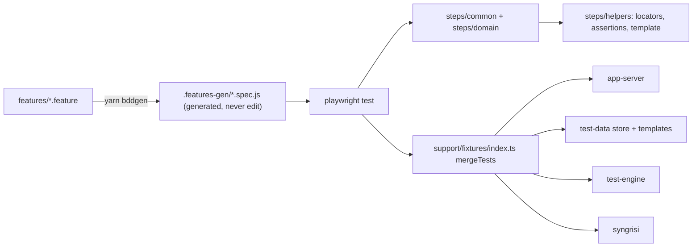
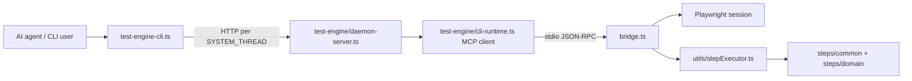
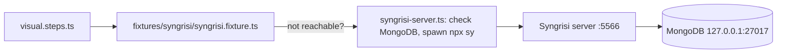

# Architecture

System design of the Playwright BDD E2E boilerplate. Agent rules live in [AGENTS.md](AGENTS.md); the generated step reference is [docs/agent/STEPS.md](docs/agent/STEPS.md).

## Test Execution Flow

Gherkin features are compiled into Playwright specs by `bddgen`; the generated specs import step definitions that receive merged fixtures.

Key points:

- `support/fixtures/index.ts` merges all fixtures via `mergeTests` and exports `Given/When/Then` (`createBdd`). Step files import them from `@fixtures`.
- Custom BDD parameter types (`{role}`, `{ordinal}`, `{condition}`) are registered in `support/params.ts`.
- The `test-data` fixture resolves `<baseUrl>` and stored values inside step arguments (template engine in `steps/helpers/template.ts`).
- Config is validated by envalid in `config.ts`; Playwright wiring is in `playwright.config.ts` (Chromium only, retries 2, traces on locally).

## MCP Test Engine (support/mcp/)

Lets an AI agent drive a persistent browser session step-by-step. Detailed rules: [support/mcp/AGENTS.md](support/mcp/AGENTS.md).

- One detached daemon per `SYSTEM_THREAD`; session state is persisted by `test-engine-state.ts` and inspected with `status --json`.
- `test-engine.ts` is a thin re-export of the public API; implementation lives in `support/mcp/test-engine/` (parser, runtime, daemon, formatters, state helpers).
- Everything under `support/mcp/` uses relative imports — the bridge runs without tsconfig path resolution.
- `server.ts` exposes the same engine as an MCP server (`yarn test:mcp`).
- **Wire contract**: tool results carry a machine-readable envelope (`structuredContent: {status, message, errorCode, artifacts}`, see `utils/protocol.ts`) alongside human-readable text; layers classify errors by `errorCode`, not by regexing text. Tool inputSchemas are generated from the executor zod schemas (`zodToJsonSchema`) so the advertised contract cannot drift from runtime validation.
- **Dependency guard**: `test/dependency-contract.spec.ts` pins the zod v3 requirement (playwright-mcp-advanced imports the hoisted zod and converts schemas with zod-to-json-schema, which breaks on zod v4); `resolutions` in package.json enforce it.

## Visual Regression (Syngrisi)

- The fixture pings `SYNGRISI_BASE_URL` before the first visual check and autostarts Syngrisi; MongoDB availability is pre-checked with a fast TCP probe (clear error instead of a 60 s timeout).
- Baselines are accepted in the Syngrisi UI; never edit `.snapshots-images/` manually.
- Disable globally with `DISABLE_VISUAL_CHECKS=true` or per-test with `@no-visual`.

## Directory Responsibilities

| Path | Responsibility |
| --- | --- |
| `features/` | Gherkin scenarios (source of truth for tests) |
| `.features-gen/` | Generated specs — never edit |
| `steps/common/` | Universal steps (~150, stable public API) |
| `steps/domain/` | Project-specific steps (empty in boilerplate) |
| `steps/helpers/` | Locator builders, assertion helpers, template engine |
| `support/fixtures/` | Playwright fixtures, merged in `index.ts` |
| `support/mcp/` | MCP server, bridge, test-engine CLI (own AGENTS.md) |
| `support/demo/` | Demo utilities (highlight, speech, progress) |
| `scripts/` | Maintenance scripts (`generate-steps-doc.ts`) |
| `docs/agent/` | Agent guides + generated STEPS.md |
