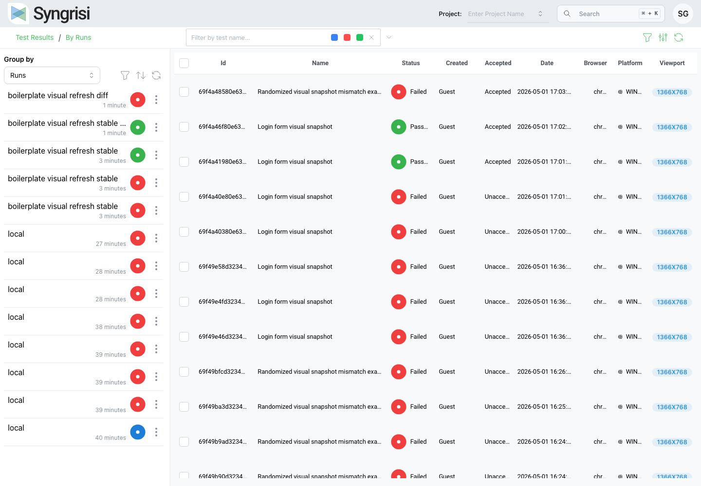
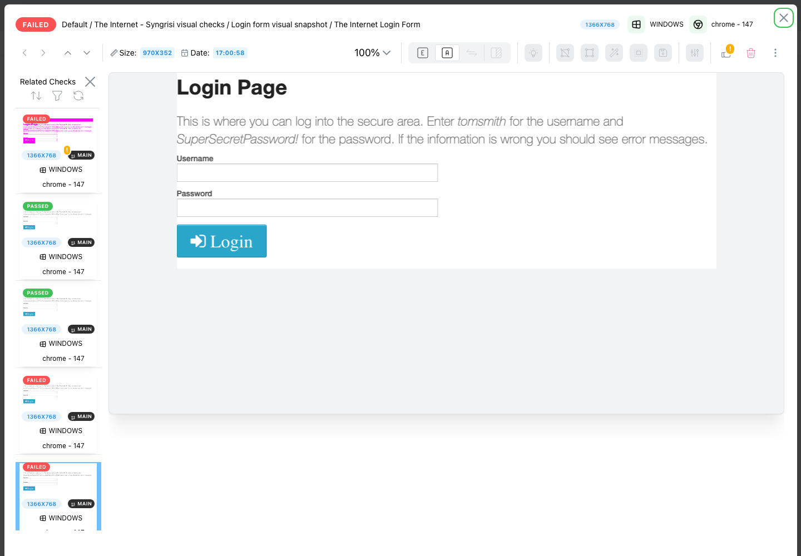
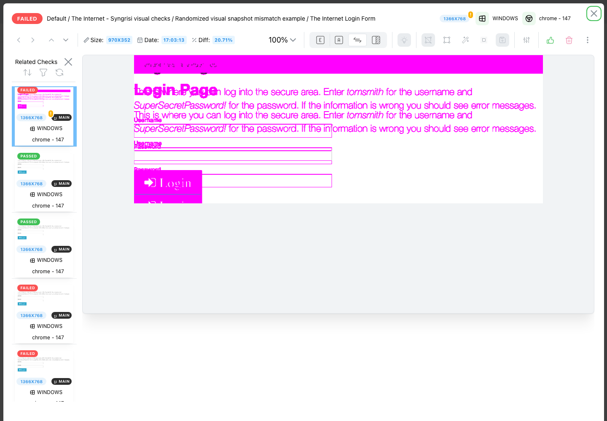

# Syngrisi Playwright BDD Boilerplate

Write visual regression tests in plain Gherkin and run them against [Syngrisi](https://github.com/syngrisi/syngrisi) — powered by [Playwright](https://playwright.dev) and [`playwright-bdd`](https://github.com/vitalets/playwright-bdd).

```gherkin
Scenario: The dashboard looks right
  When I open site "<baseUrl>"
  Then the "#chart" visual snapshot matches "Dashboard chart"
  And the "page" visual snapshot matches "Dashboard"
```

No assertions to write, no screenshots to manage by hand — Syngrisi stores baselines and shows you the diffs.

## Quick start

You need **Node.js ≥ 22.19** and **MongoDB ≥ 8** running locally ([how to start MongoDB](#mongodb)).

```bash
yarn install        # installs dependencies + Chromium
yarn sy             # starts the Syngrisi server at http://localhost:5566
yarn test:visual    # runs the example visual checks
```

The first run creates **new baselines** (they pass automatically). Open <http://localhost:5566>, review and **accept** them, then run `yarn test:visual` again — now it compares against the accepted baselines.

That's the whole loop. Everything below is optional.

## Write your first test

Add a `.feature` file under `features/`, tag it `@visual`, and use the visual-check step:

```gherkin
@visual
Feature: Checkout page

  Scenario: Checkout looks right
    When I open site "<baseUrl>/checkout"
    Then the "#summary" visual snapshot matches "Order summary"   # any CSS selector
    And the "page" visual snapshot matches "Checkout viewport"    # current viewport
    And the "full page" visual snapshot matches "Checkout full"   # full scrollable page
```

Run it:

```bash
yarn test:visual
```

You get ~150 ready-made steps for navigation, clicks, forms, assertions, waits and more — so most scenarios need **no custom code**. A few examples:

```gherkin
When I open site "<baseUrl>"
When I click element with locator "#submit"
When I fill "hello" into element with label "Name"
Then the heading "Welcome" should be visible
Then the element with locator "#message" should have contains text "Success"
```

See the full catalog in [`docs/agent/STEPS.md`](docs/agent/STEPS.md). The `<baseUrl>` placeholder (and helpers like `<generateEmail>`) are resolved from your config at runtime.

## How visual regression works

1. A scenario tagged `@visual` takes a screenshot and sends it to Syngrisi.
2. **No baseline yet?** It's saved as a *new* baseline and the check passes. You review and accept it in the UI.
3. **Baseline exists?** The new screenshot is compared to it. Identical → pass. Different → **fail**, with a pixel diff in the UI.

| Run overview | New baseline | Failed check | Diff view |
| --- | --- | --- | --- |
|  |  |  |  |

The example suite (`features/syngrisi/visual_demo_app.feature`) checks the [Syngrisi demo app](https://viktor-silakov.github.io/syngrisi-demo-app/) and includes a regression-detection demo you can run once a baseline exists:

```bash
yarn test:visual:failing   # intentionally fails — proves diffs are caught
```

> **Tip:** in the Syngrisi table, expand the test row and open the nested check card. The id in the top-level grouped table is a *test* id, not a check id — if a modal shows `Empty check data`, remove `checkId` from the URL and open the nested check.

## Configuration

Copy `.env.example` to `.env` and override what you need. The defaults work out of the box.

| Variable | Default | Description |
| --- | --- | --- |
| `E2E_BASE_URL` | `https://the-internet.herokuapp.com` | Resolves `<baseUrl>` in features |
| `SYNGRISI_BASE_URL` | `http://localhost:5566/` | Syngrisi server URL |
| `SYNGRISI_DB_URI` | `mongodb://127.0.0.1:27017/e2eBoilerplateSyngrisiDB` | MongoDB connection |
| `SYNGRISI_PROJECT` / `SYNGRISI_BRANCH` | `MyProject` / `main` | Groups baselines in Syngrisi |
| `DISABLE_VISUAL_CHECKS` | `false` | Skip all visual checks (or tag a scenario `@no-visual`) |
| `PLAYWRIGHT_HEADED` | `false` | Run the browser headed |

<a name="mongodb"></a>**Starting MongoDB** — Syngrisi stores all its data there (projects, tests, runs, checks, baselines and snapshots):

```bash
# macOS (Homebrew)
brew tap mongodb/brew && brew install mongodb-community && brew services start mongodb-community

# or Docker (any platform)
docker run -d --name syngrisi-mongo -p 27017:27017 mongo:8
```

For other platforms, see the [official MongoDB installation guide](https://www.mongodb.com/docs/manual/administration/install-community/).

## All commands

<details>
<summary>Full command reference</summary>

| Command | What it does |
| --- | --- |
| `yarn sy` | Start the Syngrisi server (port 5566, auth disabled) |
| `yarn test:visual` | Run the stable Syngrisi visual checks |
| `yarn test:visual:failing` | Run the regression-detection demo (expected to fail) |
| `yarn test` | Run the non-visual E2E suite (Chromium) — no Syngrisi needed |
| `yarn test:headed` | Run tests with a visible browser |
| `yarn test:smoke` / `yarn test:examples` | Run `@smoke` / `@example` scenarios |
| `yarn bddgen` | Generate Playwright specs from `.feature` files |
| `yarn test:unit` | Pure-logic helper unit tests (no browser, < 1s) |
| `yarn test:mcp` | MCP test-engine subsystem tests |
| `yarn lint` / `yarn format` | Biome lint / auto-format |
| `yarn verify` / `yarn type-check` | CI gates: Biome check + TypeScript |
| `yarn steps:docs` | Regenerate `docs/agent/STEPS.md` |

Before pushing: `yarn verify && yarn type-check && yarn test:unit`. CI ([.github/workflows/ci.yml](.github/workflows/ci.yml)) runs static, unit, e2e and visual jobs.

</details>

## Adding custom steps

Most scenarios are covered by the built-in steps. When you need something app-specific, add it under `steps/domain/`:

```ts
import { When } from '@fixtures';

When('I do a project-specific action', async ({ page }) => {
  await page.getByRole('button', { name: 'Run' }).click();
});
```

<details>
<summary>Project structure</summary>

```text
.
├── features/          # Gherkin scenarios (syngrisi/, the-internet/, examples/)
├── steps/
│   ├── common/        # ~150 reusable step definitions
│   ├── domain/        # your project-specific steps
│   └── helpers/       # locator, assertion, template helpers
├── support/
│   ├── fixtures/      # Playwright/BDD fixtures (incl. Syngrisi)
│   └── mcp/           # MCP test engine + CLI
├── tests/unit/        # pure-logic unit tests
├── docs/agent/        # testing guides + generated STEPS.md
├── config.ts          # environment config
└── playwright.config.ts
```

</details>

## AI-assisted development

This repo is set up for AI coding agents (Claude Code, Cursor, Copilot, Codex):

- [`AGENTS.md`](AGENTS.md) — single source of agent instructions (`CLAUDE.md` is a symlink)
- [`docs/agent/`](docs/agent/) — task guides; [`STEPS.md`](docs/agent/STEPS.md) is the generated step reference
- **MCP Test Engine** — drive a live browser from an agent:

  ```bash
  export SYSTEM_THREAD=agent-session
  npx tsx support/mcp/test-engine-cli.ts start my-session --headed
  npx tsx support/mcp/test-engine-cli.ts step "I open site \"<baseUrl>\""
  npx tsx support/mcp/test-engine-cli.ts shutdown
  ```

## License

MIT — see [LICENSE.md](LICENSE.md).
